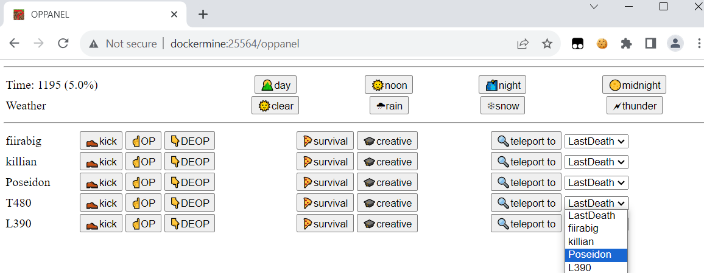
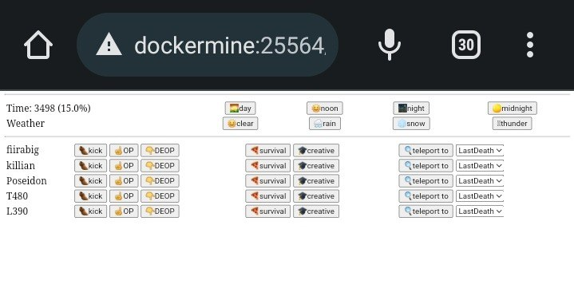

# Minecraft Server Companion
Little Flask-ui for small teams, allowing time and weather changes, and teleporting players to each other.





### Requirements
Everything for minecraft of coarse. we're using [mc server container](https://github.com/itzg/docker-minecraft-server) and [docker-compose](https://docs.docker.com/compose/install/)

### get started
```python
# install python requirements
pip3 install mcrcon flask apscheduler requests

# add as service
sudo systemctl enable --now ${PWD}/McServerCompanion.service

# test the rcon module
import socket
from mcrcon import MCRcon
mcr = MCRcon( socket.gethostname(), "changeme_iam_a_password")
mcr.connect()
print(mcr.command("say hi"))
print(mcr.command("list uuids"))
```

### access this UI
http://your-server:25564
